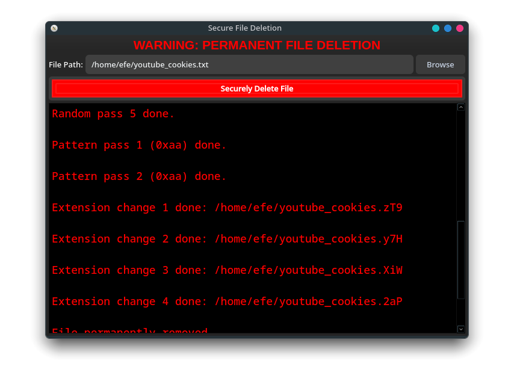

# 🚨 Secure File Deletion (Fiendel) 🚀

## 🔥 Overview

⚠️ **Fiendel is a fast and reliable tool for permanently deleting files!** It ensures data is **irrecoverable** by using multiple overwrite passes, extension randomization, and final secure deletion. **Once a file is deleted, it's gone FOREVER!** ❌💀

## ✅ Features

- 🔹 **Multi-Pass Overwriting**: Random data and specific byte patterns overwrite file contents.
- 🔹 **Extension Randomization**: The file extension changes multiple times before deletion.
- 🔹 **Asynchronous Processing**: The GUI runs smoothly without freezing.
- 🔹 **Warning & Confirmation**: Users must confirm before deletion begins.
- 🔹 **Cross-Platform Compatibility**: Works on 🖥️ Windows & 🐧 Linux.

## 🛠 Components

### 🔹 `fiendel.cpp`
💻 The core C++ program that securely deletes files using multiple overwrite passes and extension changes before permanent removal.

### 🔹 `gui.py`
🎨 A **PyQt5 graphical interface** that allows users to select files for secure deletion with real-time status updates.

### 🔹 `requirements.txt`
📦 Contains necessary dependencies for running the GUI.

## 🚀 Installation

### **For Windows & Linux**

1️⃣ **Compile the C++ source code:**
   ```sh
   g++ -o fiendel fiendel.cpp
   ```
2️⃣ **Install Python dependencies:**
   ```sh
   pip install -r requirements.txt
   ```

## 🎯 Usage

### **Command Line (C++)**

Run the compiled binary and provide the file path:

```sh
./fiendel
```

Then enter the file path and confirm deletion. ✅

### **Graphical Interface (PyQt5)**

Run the GUI using Python:

```sh
python gui.py
```

- 🖱️ **Click** Browse to select a file.
- 🛑 **Click** Securely Delete File to start the process.
- ⚠️ **Follow** the warnings and confirm deletion.

## ⚠️ WARNING ⚠️

❌ **This software is IRREVERSIBLE! Once a file is deleted, it CANNOT be recovered! Be extremely careful before proceeding!**

❗ **Make sure you are selecting the correct file, as all data loss is PERMANENT. There is NO undo!** 🔥

## 📸 Screenshot



## 📜 License

🔖 This project is licensed under the **MIT License**. 🎯

